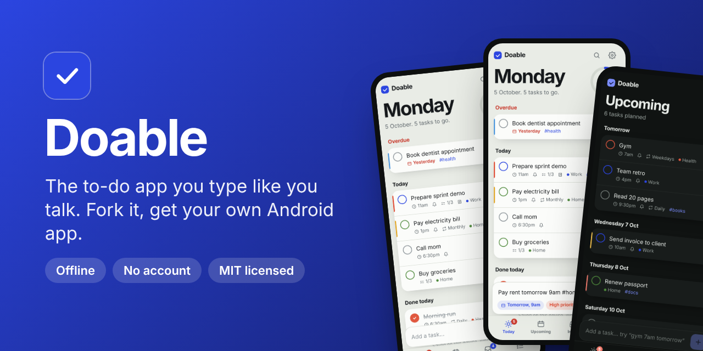
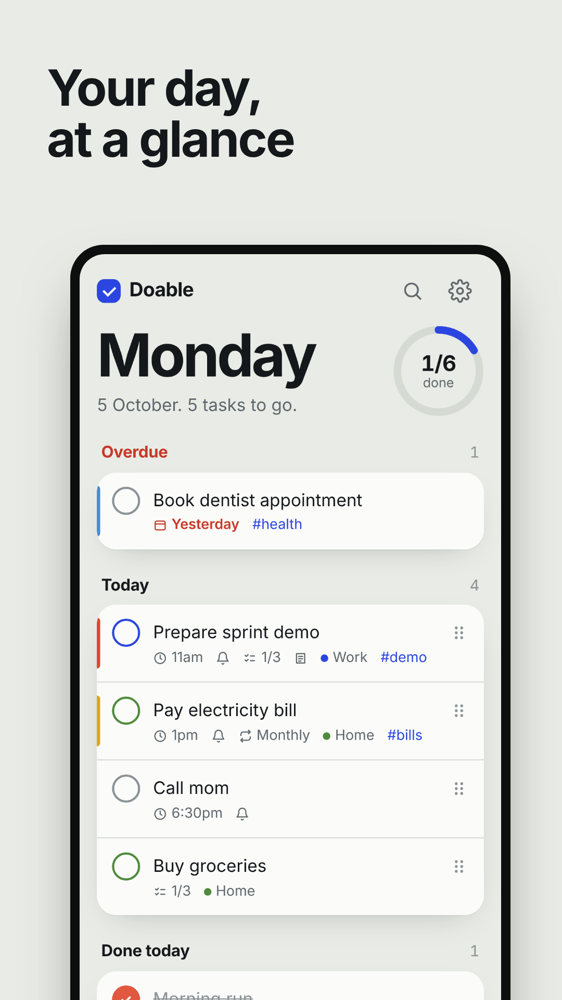
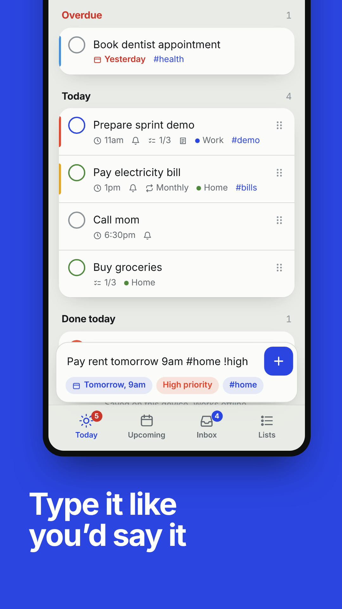
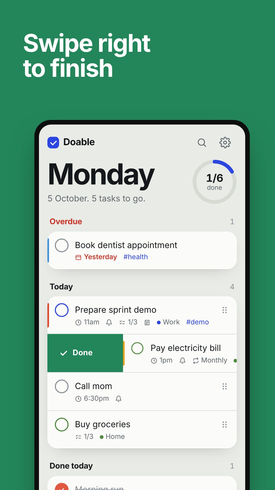
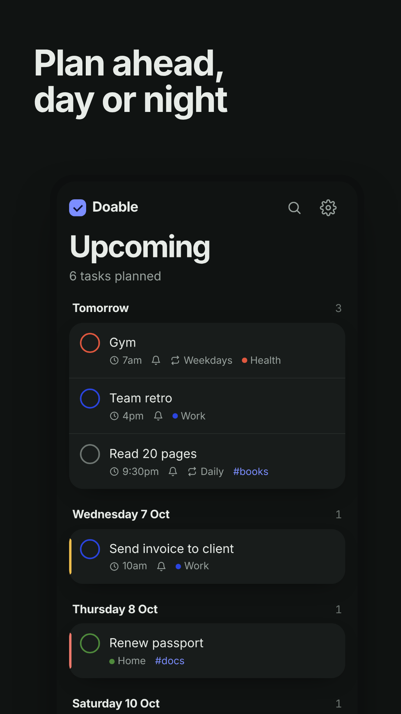

<p align="center">
  
</p>

<p align="center">
  <a href="https://github.com/maheshsurada9434/doable/releases/latest/download/doable.apk"><b>📱 Download the APK</b></a> ·
  <a href="https://maheshsurada9434.github.io/doable/"><b>🌐 Try it in your browser</b></a> ·
  <a href="#-make-it-yours-in-3-minutes"><b>🍴 Fork &amp; make it yours</b></a>
</p>

<p align="center">
  <a href="https://github.com/maheshsurada9434/doable/actions/workflows/android.yml"></a>
  <a href="https://github.com/maheshsurada9434/doable/releases/latest"></a>
  
  <a href="LICENSE"></a>
  <a href="CONTRIBUTING.md"></a>
</p>

**Doable is a to-do app that understands plain English.** Type `gym tomorrow 7am #health every weekday` and it fills in the date, time, tag and repeat for you. It reminds you on time and works offline. No account, no ads, no tracking.

It's also a **template**. Fork it, enable one GitHub Action, and you get **your own Android app** built on every push, with a downloadable APK and a Play Store–ready bundle. No Android Studio, no laptop setup. You can do it from your phone.

<p align="center">
  
  
  
  
</p>

## ✨ What it does

| | |
| --- | --- |
| ⌨️ **Type it like you'd say it** | `today` `tomorrow` `next friday` `15 oct` `31/12` `in 3 days` · `9am` `6:30pm` `tonight` · `every monday` `daily` `monthly` · `#tags` `!high` `@List` |
| 🧠 **Brain dump** | Paste a whole list (from notes, WhatsApp, anywhere) and every line becomes a task, dates included |
| 🔔 **Reminders that actually arrive** | Real Android notifications at the time you set, or up to a day before. Optional morning summary |
| 👆 **Swipe** | Right to finish. Left to push it to tomorrow. Undo for everything |
| 📸 **Share my day** | A story-sized image of what you got done, ready for Instagram or WhatsApp |
| 🔥 **Streaks** | Your streak and what you finished this week |
| ⏱️ **Focus timer** | 25 minutes, one task, nothing else |
| 🗂️ **Lists, subtasks, notes, priorities** | Colour-coded lists, drag to reorder, search across everything |
| 🌗 **Make it yours** | Light and dark themes, six accent colours, vibration and sounds you can turn off |
| 🔒 **Private by design** | Tasks never leave your phone. Export a backup file whenever you like |

## 🍴 Make it yours in 3 minutes

You can do all of this from the GitHub app or a phone browser.

1. **Fork** this repo (button at the top right).
2. In your fork, open **Actions** and tap **I understand my workflows, go ahead and enable them**.
3. Push any change, or open **Actions → Android build → Run workflow**.

About 8 minutes later, **Releases** in your fork has `doable.apk`. Open it on your phone to install. Your build gets its own app ID (`io.github.<you>.<repo>`), so it never clashes with anyone else's.

**Want the web version too?** Settings → Pages → Branch: `main` → Save. It goes live at `https://<you>.github.io/<repo>/`.

Then change things:

| To change | Edit |
| --- | --- |
| App name, app ID, icon background, splash colours | [`app.config.json`](app.config.json) |
| App icon and splash screen | Replace the images in [`assets/`](assets/) |
| Everything you see and do | [`index.html`](index.html) (one file: HTML, CSS and JS, no framework, no build step) |
| Version shown in the Play Store | `version` in [`package.json`](package.json) |

Full guide, including signing your own release build for Google Play: **[CUSTOMIZE.md](CUSTOMIZE.md)**.

## 🧱 How it's built

- **One file**: [`index.html`](index.html) is the whole app. Vanilla JS, no framework, no bundler. Open it in a browser and it runs.
- **Android**: [Capacitor 8](https://capacitorjs.com) wraps the same file and adds notifications, haptics, sharing and the back button. Targets Android 16 (API 36), as Google Play requires.
- **CI**: [`.github/workflows/android.yml`](.github/workflows/android.yml) generates the Android project, icons and splash screens, builds the APK and the `.aab` bundle, and publishes a GitHub Release.
- **Storage**: `localStorage` on the device. Nothing is sent anywhere.

```
index.html            the app
app.config.json       name, app ID, colours for your build
assets/               icon + splash sources
android-res/          notification icon
scripts/ci-build.sh   the Android build
store/                Play Store screenshots, graphics and listing text
privacy.html          privacy policy (needed for Google Play)
```

## 🗺️ Ideas and good first issues

Want to help? Pick one. Each is a self-contained change in `index.html`:

- Calendar month view
- Hindi / Hinglish date words (`kal`, `parso`, `somvar`)
- Home screen widget (Android)
- Task templates ("morning routine", "packing list")
- Pomodoro breaks and custom focus lengths
- More share-card styles
- Import from Google Tasks / Todoist export

See [CONTRIBUTING.md](CONTRIBUTING.md). Small PRs are very welcome.

## ⭐ Like it?

Star the repo so more people find it, and share your fork. I'd love to see what you build.

## License

[MIT](LICENSE). Use it, fork it, ship your own version. A link back is appreciated, not required.
